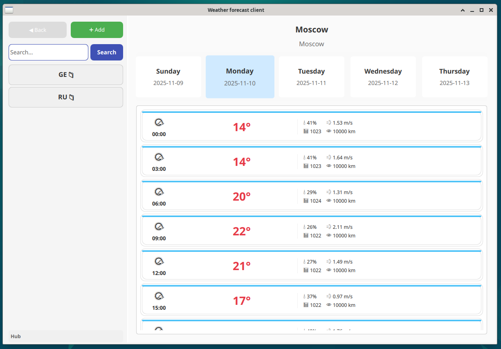

# Weather Forecast App 🌤️



🎓 **Educational Project** - A weather application built to learn modern C++, Qt/QML, and software architecture.

## 🚀 Features

- **5-Day Weather Forecast** - Detailed predictions with temperature ranges
- **Hourly Weather Breakdown** - Weather changes throughout the day  
- **City Search & Selection** - Easy location management with GeoNames integration
- **Modern QML Interface** - Smooth animations and responsive design
- **Geolocation Support** - Automatic location detection

## 🛠️ Installation

### **Prerequisites**
- Qt 6.5 or higher
- C++23 compatible compiler (GCC 11+, Clang 12+)
- CMake 3.16+

### **Configuration Notes**
- API keys are pre-configured for immediate use
- Cache files are stored in `QStandardPaths::AppDataLocation + "/cache/geo-data"`
- No additional setup required - works out of the box! 🎯
### **Build Instructions**
```bash
git clone https://github.com/Sibro18/weather_app
cd weather_app


mkdir build && cd build
cmake ..
make -j$(nproc)
./weather-app
```

## 🧠 Skills Demonstrated
- **Object-Oriented Design** with modern C++ patterns and SOLID principles
- **Multithread Programming** with Qt Concurrent and task management
- **C++23** with modules, concepts, and modern idioms
- **Qt6/QML** for cross-platform GUI development
- **REST API Integration** with OpenWeatherMap and GeoNames
- **CMake Build System** mastery with modern practices
- **Clean Architecture** implementation with layered design

## 📁 Project Structure

```
weather-app/
├── backend/
│   ├── core/           # Domain entities
│   ├── infrastructure/ # API controllers, cache
│   ├── application/    # Services, data providers
│   └── view-models/    # QML-friendly adapters
├── frontend/           # QML interface
├── resources/          # Configuration files.
```

## 🙏 Acknowledgments

- Weather data provided by [OpenWeatherMap](https://openweathermap.org/)
- Location data from [GeoNames](http://www.geonames.org/)
- Icons from [Feather Icons](https://feathericons.com/)
- Built with [Qt Framework](https://www.qt.io/)